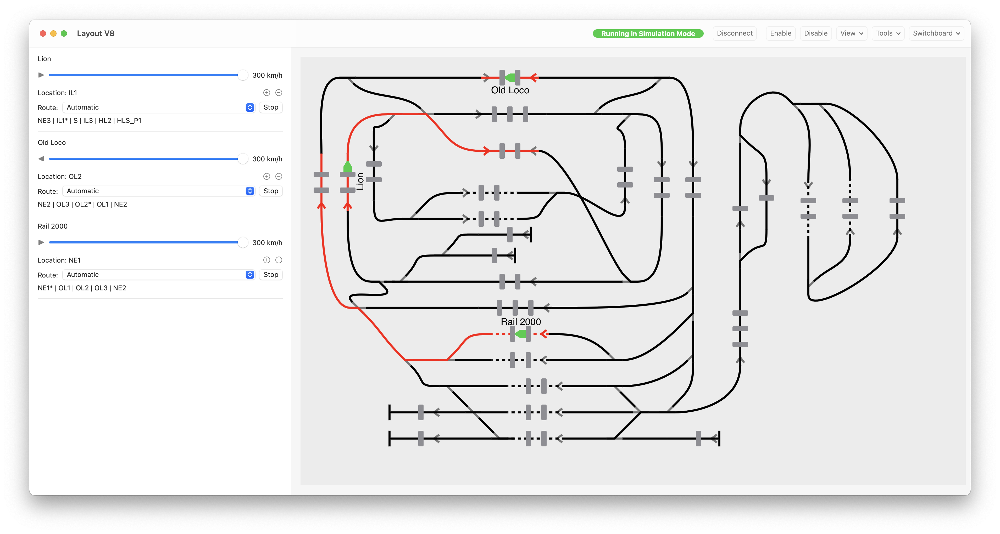
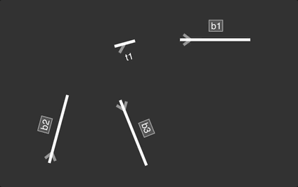
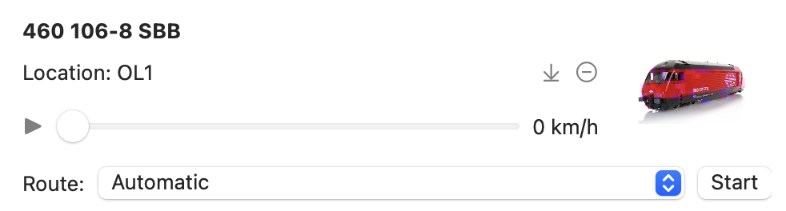
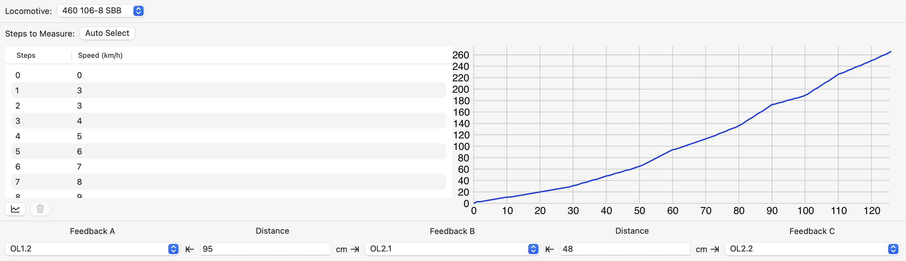
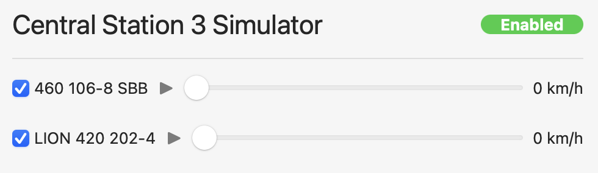

**Welcome**

BTrain is my attempt at automating a model railway layout. It is open-source and free to use but still experimental: use it at your own risk!

BTrain allows the layout to be created quickly with just a few clicks. Each block is connected to another block using curves that can be dragged and dropped.

BTrain renders many details of the train in the layout, including the position and direction of travel of the locomotive and its wagons and the name of the block. Individual feedbacks located in the block are displayed and expected feedbacks - when BTrain is in charge of monitoring the position of each train.

Each train's direction, speed, and position is controlled via a dedicated section. A train can follow a predefined route or a random route created on the fly as the train moves through the layout.

BTrain allows each locomotive's speed to be measured using 3 feedbacks. This measurement enables the locomotive speed to represent its prototype accurately and ensures all locomotives move at the same speed regardless of their decoder type.

An embedded Marklin Central 3 station simulator allows BTrain to simulate a layout entirely offline, allowing the development of the layout without connecting to a real Central Station 3 until it is ready.

**Features**

- Easy to use layout editor where blocks and turnouts can be added in one click and linked together by dragging and dropping links between them.
- Locomotives speed and direction control
- Locomotive speed measurements
- Turnouts state control
- Automatic (or manual) routing management of one or more trains simultaneously with collision avoidance
- Take into account the length of the train, block, turnout, and feedback position to accurately understand the location of each train to reserve the necessary block to avoid a collision.
- Visual feedback of the exact location of the train, including the locomotive and its wagons, within blocks
- Unexpected feedback detection
- Automatic discovery of locomotives
- Support for Marklin Central Station 3
- Layout simulator to simulate the movement of the trains, including feedbacks and turnouts, without having to connect to a real Central Station 3

**Limitations**

- Locomotives pushing their wagons is only partially supported today.

**Known Issues**

- The document does not get marked as "Edited" for some changes.

**Glossary**

- Block: a logical grouping of rails where one and only one train can be present at a time.
- Turnout: an element that guides a train from one rail to another
- Feedback: an element that indicates when a train is present or not
- Transition: any stretch of track between a block and turnout (and any combination of)
- Route: a series of blocks that a train follows

**References**

- [MFX](http://www.skrauss.de/modellbahn/Schienenformat.pdf) (German)
- [Marklin CS2 CAN Protocol version 1.0](https://www.maerklin.de/fileadmin/media/produkte/CS2_can-protokoll_1-0.pdf) (German)
- [Marklin CS2 CAN Protocol version 2.0](https://streaming.maerklin.de/public-media/cs2/cs2CAN-Protokoll-2_0.pdf) (German)
- Thanks to Frans Jacobs for his [open-source project](https://github.com/fransjacobs/model-railway) that inspired me to create the initial command interface to the Central Station.

**Copyrights**

- [Application icon](https://thenounproject.com/icon/train-3130173/) (c) Manaqib S from NounProject.com
- [GzipSwift](https://github.com/1024jp/GzipSwift) (c) 2014-2020 1024jp
- [Undo Provider](https://github.com/LostMoa/UndoProviderExample) (c) 2020 by Matthaus Woolard
- Unit tests use [ViewInspector](https://github.com/nalexn/ViewInspector) by Alexey Naumov
    
**Copyright 2021-22 Jean Bovet**

Permission is hereby granted, free of charge, to any person obtaining a copy of this software and associated documentation files (the "Software"),
to deal in the Software without restriction, including without limitation the rights to use, copy, modify, merge, publish, distribute, sublicense,
and/or sell copies of the Software, and to permit persons to whom the Software is furnished to do so, subject to the following conditions:

The above copyright notice and this permission notice shall be included in all copies or substantial portions of the Software.

THE SOFTWARE IS PROVIDED "AS IS", WITHOUT WARRANTY OF ANY KIND, EXPRESS OR IMPLIED, INCLUDING BUT NOT LIMITED TO THE WARRANTIES OF MERCHANTABILITY,
FITNESS FOR A PARTICULAR PURPOSE AND NONINFRINGEMENT. IN NO EVENT SHALL THE AUTHORS OR COPYRIGHT HOLDERS BE LIABLE FOR ANY CLAIM, DAMAGES OR OTHER LIABILITY,
WHETHER IN AN ACTION OF CONTRACT, TORT OR OTHERWISE, ARISING FROM, OUT OF OR IN CONNECTION WITH THE SOFTWARE OR THE USE OR OTHER DEALINGS IN THE SOFTWARE.
